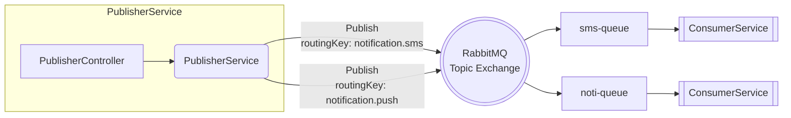

# MessageBrokerRMQService &nbsp;     

> **Light‑weight demo** showing how to publish & consume two notification channels (**SMS / Push**) in RabbitMQ using **MassTransit** on .NET 9.

---

## ✨ Key Features
| Area | Details |
|------|---------|
| **Two‑Channel Messaging** | Publishes `SendSMS` & `SendNoti` events to *different queues* via a single **topic exchange** |
| **MassTransit Abstractions** | Strongly‑typed message contracts, retry, consumer configuration |
| **Decoupled Services** | Independent *Publisher* & *Consumer* ASP.NET Core projects |
| **Docker‑Ready** | `docker-compose.yml` spins up RabbitMQ + the two services |
| **Health Probes** | `/api/healthcheck/status` endpoints for readiness checks |

---

## 🛠️ Tech Stack

- **.NET 9** / **ASP.NET Core**  
- **MassTransit**  
- **RabbitMQ 3‑management**  
- **Docker**  
- **Serilog** structured logging  

---

## 🗂️ Project Structure



---

## 📚 REST Endpoints

| Service | Verb | Path | Purpose |
|---------|------|------|---------|
| **Publisher** | `POST` | `/api/publisher/SendSMS` | Publish **SMS** message ➜ `sms-queue` |
| **Publisher** | `POST` | `/api/publisher/SendNoti` | Publish **Push** notification ➜ `noti-queue` |
| **Publisher** | `GET`  | `/api/healthcheck/status` | Liveness probe |
| **Consumer**  | `GET`  | `/api/healthcheck/status` | Liveness probe |

### 🔑 Sample Payloads

<details>
<summary><code>POST /api/publisher/SendSMS</code></summary>

```json
// request
{
  "userId": "b21d3cef-1d5e-4cfa-9bc5-bc1bffc364d5",
  "mobileNumber": "0890000000",
  "message": "Hello from demo 🚀",
  "systemName": "DemoApi"
}

// response
{
  "status": 200,
  "success": true,
  "message": "Message published to sms-queue"
}
```
</details>

<details>
<summary><code>POST /api/publisher/SendNoti</code></summary>

```json
// request
{
  "userId": "b21d3cef-1d5e-4cfa-9bc5-bc1bffc364d5",
  "deviceId": "fcm:abc123",
  "message": "You've got mail!",
  "systemName": "DemoApi"
}

// response
{
  "status": 200,
  "success": true,
  "message": "Message published to noti-queue"
}
```
</details>

---

## 🚀 Quick Start

```bash
git clone https://github.com/tanapoomjaisabay/MessageBrokerRMQService.git
cd MessageBrokerRMQService

# spin up RabbitMQ + services
docker compose -f infrastructure/docker/docker-compose.yml up -d
```

Open RabbitMQ UI **<http://localhost:15672>** or hit the Swagger UIs:

* Publisher → <http://localhost:5003/swagger>  
* Consumer → <http://localhost:5004/swagger>

---

## 🤝 Contributing

PRs are welcome! Feel free to open issues, suggest refactors, or add new features.

---

## 📜 License

Distributed under the **MIT** license. See `LICENSE` for more info.
